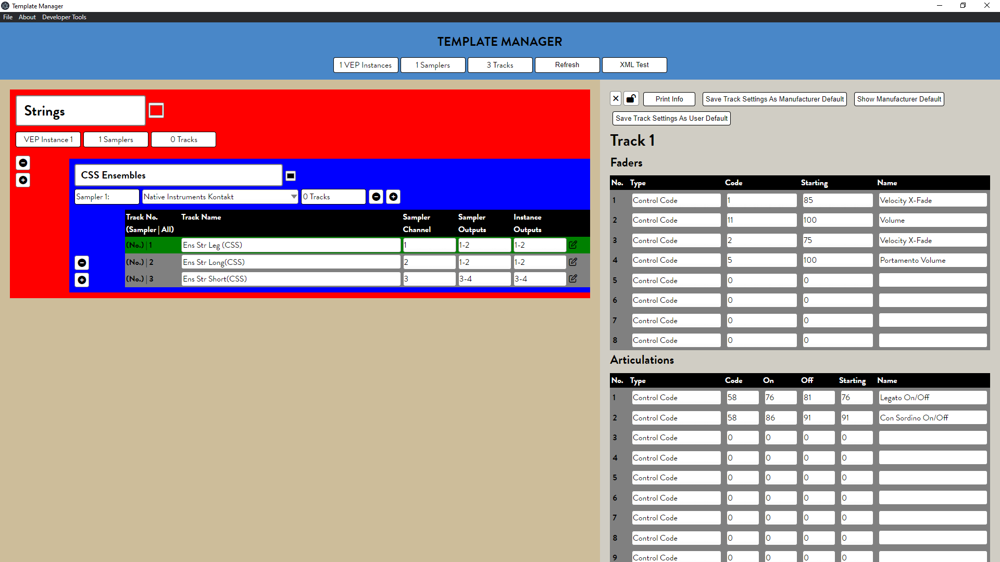

# Template
## What you need to know:

- **Open Stage Control (OSC)** is a "Libre and modular OSC / MIDI controller" used on touch screens in music production environments. ([view repo](https://github.com/jean-emmanuel/open-stage-control.git))
    - **template.json** is my OSC work file which contains buttons, widgets, sliders, etc.

    - **template.js** is a "custom module" that can be loaded into Open Stage Control.

    - **tracks.json** is a list of names, parameters, playable ranges, etc. for the orchestral instrument VSTs (hosted in VEP) that I use in Cubase. These parameters are viewed and adjusted in OSC via the custom module. Currently, I keep track of these parameters in a dirty Excel document and convert to JSON online, although I am designing a desktop program to streamline and enhance this process.

- **Vienna Ensemble Pro (VEP)** hosts Virtual Instruments, Samplers, VSTs, etc.

- **Cubase** is a digital audio workstation (DAW)
    - **GR1-OSC1-CH2.xml**, etc. are "Generic Remotes" that are used and configured in Cubase. They correlate with certain buttons and widgets in OSC and among other things, essentially allow for key commands to be activated with MIDI commands.

## the OSC launcher

## the OSC client with my work file loaded

## Editing a Generic Remote in Cubase

## Custom Module in action
Thanks to my custom module, every time I select a MIDI track, Cubase sends a unique signal to OSC, which allows my touchscreen to display that specific track's available parameters in real time.

## Template Manager
Work in progress! This is definitely ugly right now, and for that I don't feel I'm ready to make that repo public. But soon enough it will replace an EVEN UGLIER Excel document :)

