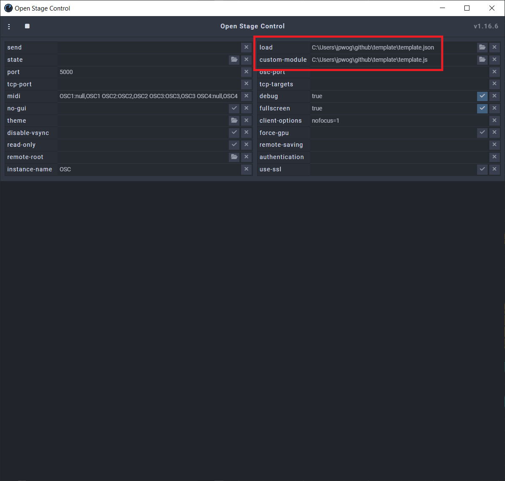
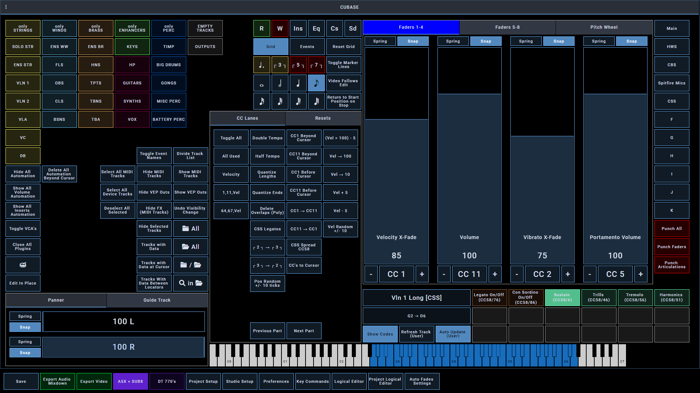
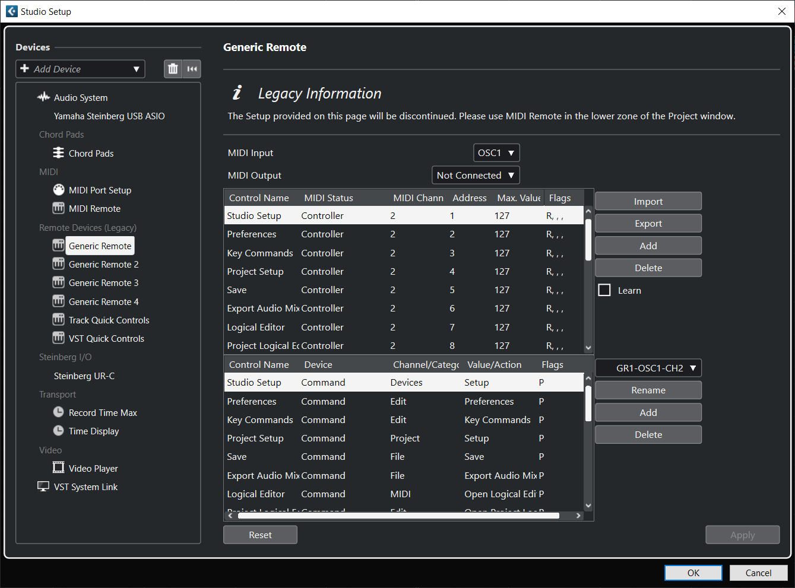

# Template
Open Stage Control, Vienna Ensemble Pro, Cubase

- template.json is my Open Stage Control work file which contains buttons, widgets, sliders, etc. (https://github.com/jean-emmanuel/open-stage-control.git)

- template.js is a "custom module" that can be loaded into Open Stage Control

- tracks.json is a list of names, parameters, playable ranges, etc. for the orchestral instrument VSTs I use in Cubase. these is viewed in Open Stage Control via the custom module.

- GR1-OSC1-CH2.xml, etc. are "Generic Remotes" that are used in Cubase. They correlate with certain buttons and widgets in Open Stage Control and among other things, essentially allow for key commands to be accessed with MIDI commands.

# Open Stage Control

the OSC launcher

the OSC client with my work file loaded

# Cubase
Generic Remote loaded into Cubase

Custom Module in action

